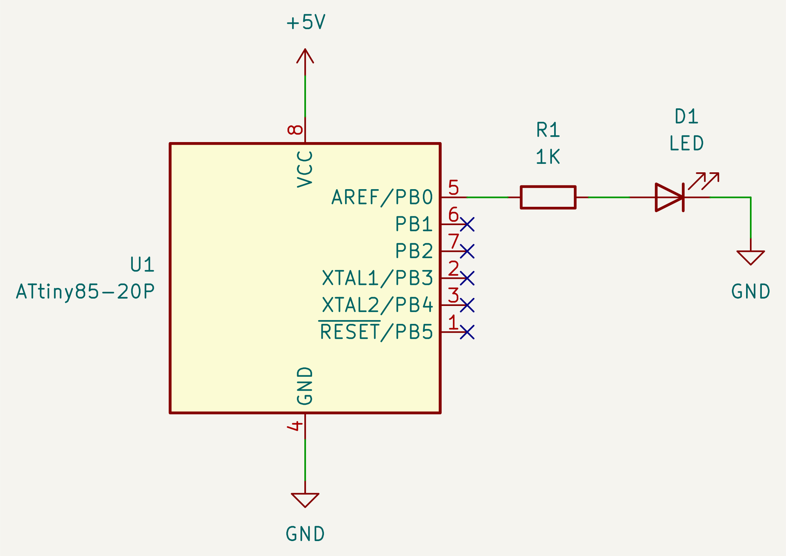

# AVR blink example
An example to demonstrate a `blink` program.

The program blinks an LED at 0.5Hz, or toggle the LED every one second.

Note that the program assumes the factory default CPU clock. If the LED
toggles at longer interval, check the FUSE bits. See
[AVR® Fuse Calculator](https://www.engbedded.com/fusecalc/).

The target is ATTiny85, but can be used with other AVR MCUs.

To upload program, use
["Arduino as ISP"](https://docs.arduino.cc/built-in-examples/arduino-isp/ArduinoISP)
or my
[AVR programmer](https://github.com/trombik/kicad-avr-programmer).

## Schematic



## Building and uploading

```console
pio run
pio run -e attiny85 -t upload --upload-port /dev/cuaU0
```
