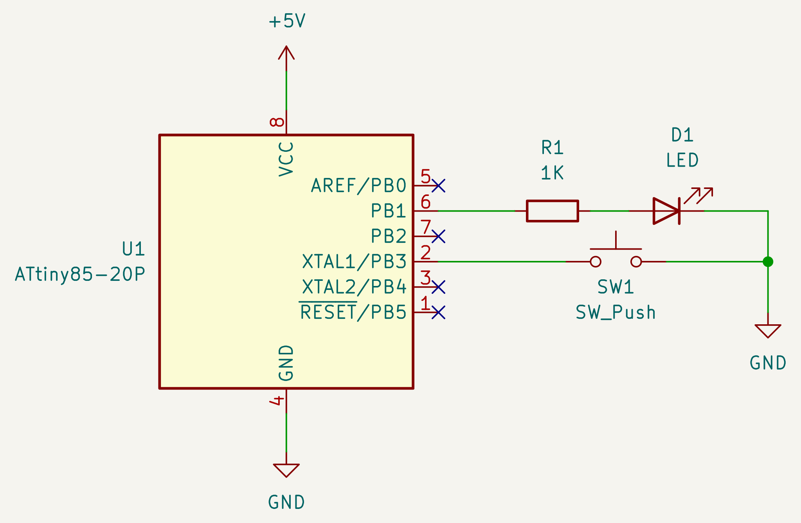

# AVR I/O example

An example to demonstrate input and output on AVR MCUs.

When `SW1` is released, the `D1` turns on. When `SW1` is pushed, the `D1`
turns off.

The program uses resisters related to GPIOs, `DDRB`, `PORTB`, and `PINB`. A
pin is used as input, and another as output.

The target is ATTiny85, but can be used with other AVR MCUs.

To upload program, use
["Arduino as ISP"](https://docs.arduino.cc/built-in-examples/arduino-isp/ArduinoISP)
or my
[AVR programmer](https://github.com/trombik/kicad-avr-programmer).

## Schematic

