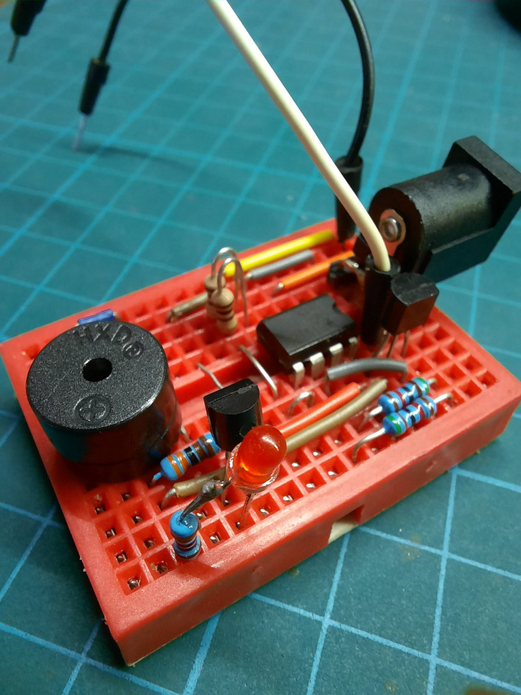
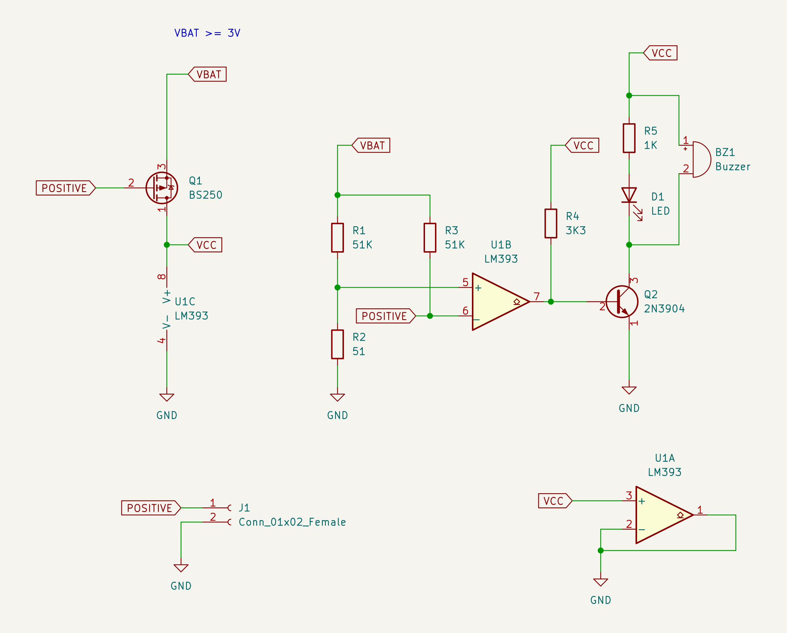

# Continuity checker

A simple continuity checker with a comparator.

Any comparator can be used.

Q1 is on when testing, and off when not, saving battery.

R2 is the resistor that determines minimum resistance whether if two probes
are connected.
