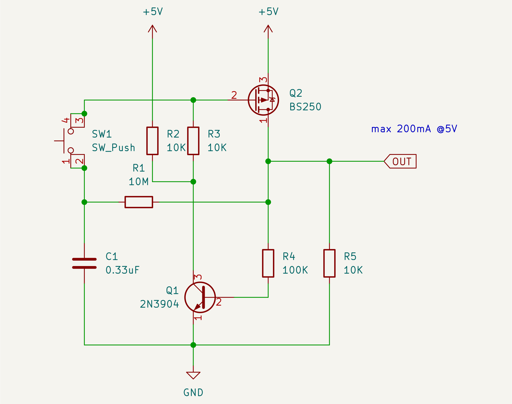

# Latching power switch uses momentary push button

A high-side switch that uses a momentary push button
([Latching power switch uses momentary pushbutton](https://www.edn.com/latching-power-switch-uses-momentary-pushbutton/)).

There are other designs, but I like the design because:

* it uses common components
* it is easy to understand how it works
* quiescent current is zero

## Notes

Make sure polarity of MOSFET is correct.

BS250 has relatively higher Rds(on) (10Ohms @200mA).

Use a bigger MOSFET to increase output current.

Use a series diode in output when the load is inductive.
