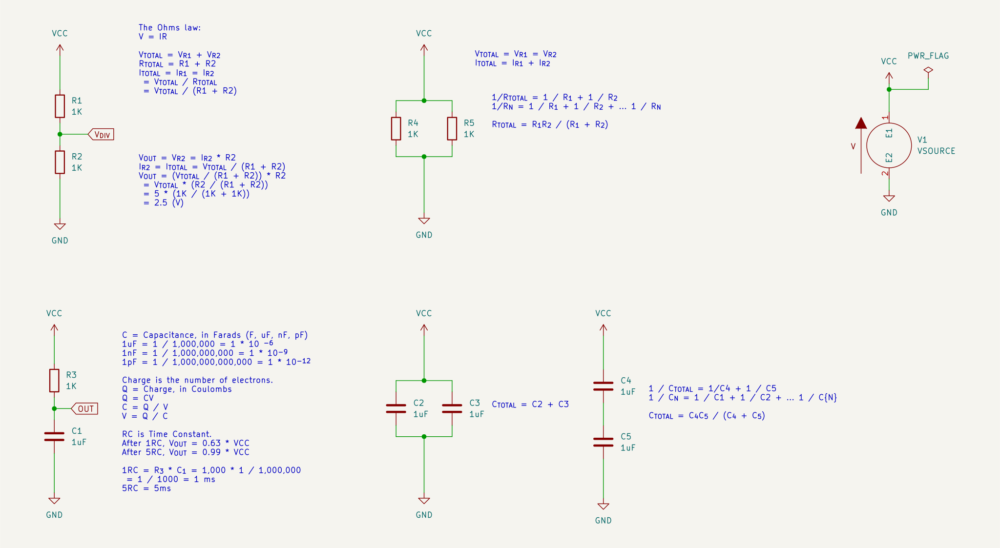
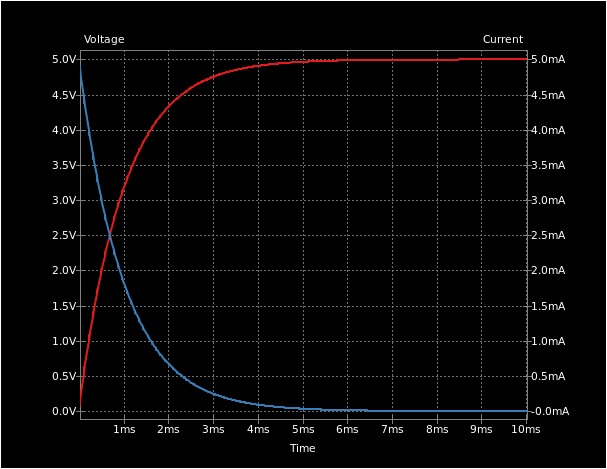

# R and C

## IV-curve in RC network

## References

* [Resistors in Series](https://www.electronics-tutorials.ws/resistor/res_3.html)
* [Resistors in Parallel](https://www.electronics-tutorials.ws/resistor/res_4.html)
* [Capacitors in Series](https://www.electronics-tutorials.ws/capacitor/cap_7.html)
* [Capacitors in Parallel](https://www.electronics-tutorials.ws/capacitor/cap_6.html)
